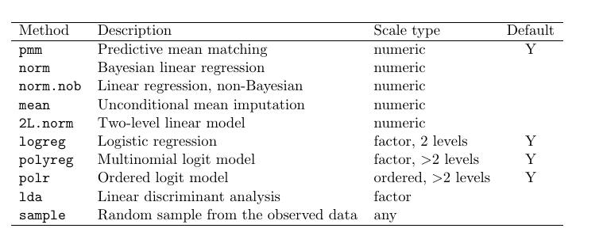

```{r, include=FALSE}
# Don't delete this chunk if you are using the mosaic package
# This loads the mosaic and dplyr packages
require(mosaic)
```

```{r, include=FALSE}
# Some customization.  You can alter or delete as desired (if you know what you are doing).

# This changes the default colors in lattice plots.
trellis.par.set(theme=theme.mosaic())  

# knitr settings to control how R chunks work.
require(knitr)
opts_knit$set(root.dir = "../../")
opts_chunk$set(
  message = FALSE,
  comment = NULL,
  tidy=FALSE,     # display code as typed
  size="small"    # slightly smaller font for code
)
```

## Packages we will use:
```{r}
require(texreg)  
require(mice)
require(VIM)
require(ztable)
require(mice)
require(gamlss)
require(rpart)
require(psych)
require(MASS)
```

```{r}
doctype <- 
   # "latex"
   "html"
txreg <- ifelse(doctype == "latex", texreg, htmlreg)
options(ztable.type = doctype)
```


```{r}
data <- whiteside
```


## A little about the Bayesian foundation of MI
```{r, eval=FALSE}
library(brms)
mod <- lm(Gas ~ Temp + Insul, data = data)
bmod <- brm(Gas ~ Temp + Insul, data = data)
summary(mod)
bmod
plot(bmod)
```

```{r, echo=FALSE}
mod <- lm(Gas ~ Temp + Insul, data = data)
load("topics/MultivariateMultipleImputation/MultivariateMultipleImputation_cache/bmod.Rdata")
summary(mod)
bmod
plot(bmod)
```

## Issues in multivariate imputation

* The predictors $Y_{-j}$ can contain missing values.
* "Circular" dependence: missingness in one variable may depend on missngness in another.
* Data often contain different types of variables (e.g. continuous, binary, ordered categorical).
* Especially with large $p$ and small $n$, collinearity or empty cells can occur.
* The ordering of rows and columns can be meaningful (e.g., longitudinal data).
* Relations between $Y_j$ and $Y_{-j}$ can be complex (e.g. non-linear, censored, interactions present).
* Imputations can create impossible values and combinations (e.g. pregnant fathers)

## Monotone imputation revisited

```{r, echo=FALSE}
### define data sets pattern1-pattern4 with four patterns
set.seed(1234)
data <- matrix(data = sample(x = 1:100, 
                             size = 4*8*3, 
                             replace=TRUE), 
               nrow = 8*4,
               dimnames = list(NULL, 
                             c("A","B","C")))
data <- as.data.frame(data)
data[c(31:32),"A"] <- NA
data[c(15:16,22:24,30:32),"B"] <- NA
data[c(6:8,12:16,17:21,27:29),"C"] <- NA

mdpat <- cbind(expand.grid(rec = 8:1, pat = 1:4, var = 1:3), r=as.numeric(as.vector(is.na(data))))
mdpat2 <- 1 - is.na(data)
pattern1 <- data[1:8,]
pattern2 <- data[9:16,]
pattern3 <- data[17:24,]
pattern4 <- data[25:32,]
### Figure 4.1
types <-  c("Univariate","Monotone","File matching","General")
tp41 <- levelplot(r~var+rec|as.factor(pat), data=mdpat, 
                  as.table=TRUE, aspect="iso",
                  shrink=c(0.9), 
                  col.regions = mdc(1:2),
                  colorkey=FALSE,
                  scales=list(draw=FALSE),
                  xlab="", ylab="",
                  between = list(x=1,y=0),
                  strip = strip.custom(bg = "grey95", style = 1,
                                       factor.levels = types))
monotone <- pattern2
general <- pattern4
rownames(monotone) <- 1:8
rownames(general) <- 1:8
monotone
print(tp41[2])
```

## General pattern is more common

```{r}
general
print(tp41[4])
```

## Two primary approaches to general MI: *Joint Modeling* and *Fully Conditional Specification*

### Joint modeling

* The algorithm, an application of "data augmentation", was developed by @schafer1997analysis, and is a specific type of Markov Chain Monte Carlo approach to Bayesian computation [@molenberghs2014handbook]. 
* It starts with the assumption that the data can be characterized with a multivariate distribution. The most common is a multivariate normal distribution. This assumption "is patently wrong for almost all real applications"[@molenberghs2014handbook, p. 256]. 
* But, it seems to work well, even for dichotomous variables, unless they are very skewed.
* Note, that for categorical variables, imputed values will vary continuously
* There is work being done for use with structured (i.e. multilevel) data.

### Fully conditional specification (FCS)

* FCS is also known as *multiple imputation with chained equations* (MICE), *sequential regression multiple imputation*, as well as *fully conditional specification*.
* It was independently proposed by @van1999multiple and @raghunathan2001multivariate for S-PLUS and SAS respectively. Stata soon followed [@royston2004multiple].
* FCS involves repeatedly cycling through variables with missing using univariate imputation techniques after filling in values needed in other variables.
* Initially, missing values in covarites are filled in with a simple approach (e.g. random sampling from observations), but "better" values are soon used to replace them (i.e. Then a miracle occurs...).


# Imputation in Practice

## Modeling choices

### Overview

We want our MI choices to:
1. Account for missing data process,
2. preserve relations in the data, and
3. preserve the uncertainty about these relations.

### Seven steps:
1. Ignorable or nonignorable?
2. Model form
3. Predictors
4. Derived variables
5. Imputation order 
6. Starting values and number of iterations
7. Number of imputations


### 1. Ignorable or nonignorable?

There are some thing we can do to explore this, but for the most part it is based on our knowledge of how data were collected and why than are most likely missing. There are not formal tests of the MAR versus MNAR mechanisms.

If you think you have nonignorable missing data mechanism you can either:

1. expand the data used in the imputation model (i.e. more predictors or auxiliary variables)
2. explicitly model the missing data mechanism and conduct sensitivity analyses (i.e. use MNAR techniques).


### 2. Model form

We need to determine what our analytic model will be. 

* What are the outcomes? 
* Which predictors will be used? 
* Are there derived variables such as composites?
* Will we include interaction or non-linear terms?

`mice` requires specification of a series of univariate imputations methods, one for each imputed variable.

#### Univariate Imputation Methods


**Predictive mean matching** A small set of candidate observed values close to the predicted value are chosen, then one observed value is randomly chosen as the imputed value. The variability in the chosen observed value reflects the uncertanty of the actual value.

```{r, echo=FALSE}
data <- whiteside
data[47,"Gas"] <- NA

mice.impute.normdump <- function (y, ry, x, ...) 
{
  x <- cbind(1, as.matrix(x))
  parm <- .norm.draw(y, ry, x, ...)
  betadump <<- c(betadump,parm$beta) 
  return(x[!ry, ] %*% parm$beta + rnorm(sum(!ry)) * parm$sigma)
}
mice.impute.pmmdump <- function (y, ry, x, ...) 
{
  x <- cbind(1, as.matrix(x))
  parm <- .norm.draw(y, ry, x, ...)
  yhatobs <- x[ry, ] %*% parm$coef
  yhatmis <- x[!ry, ] %*% parm$beta
  betadump <<- c(betadump,parm$beta)
  return(apply(as.array(yhatmis), 1, .pmm.match, yhat = yhatobs, 
               y = y[ry], ...))
}

pch <- c(rep(3,26),rep(1,30))
plot(x=data$Temp, y=data$Gas, col=mdc(1), lwd=2.5, pch=pch, 
     xlab=expression(paste("Temperature (", degree, "C)")), 
     ylab="Gas consumption (cubic feet)")
betadump <- vector("list", 0) 
imp <- mice(data, m=5, meth="pmmdump", maxit=1, print=FALSE, seed=68006)
betadump <- matrix(betadump, nc=3, byrow=TRUE)
m1<-lm(Gas~Temp+Insul, data=data, na.action=na.omit)
an <- coef(m1)[1]
ai <- an + coef(m1)[3]
b <- coef(m1)[2]
abline(a=ai, b=b, col=mdc(4))
abline(a=an, b=b, col=mdc(4))
eta <- 0.6
ylo <- ai+b*(5-eta)
yhi <- ai+b*(5+eta)
lines(x=c(5-eta,5+eta),y=c(ylo,yhi),lwd=3,col=mdc(5))
xlo <- (ylo-an)/b
xhi <- (yhi-an)/b
lines(x=c(xlo,xhi),y=c(ylo,yhi),lwd=3,col=mdc(5))

donors <- subset(data, (Insul=="After"&Temp>5-eta&Temp<5+eta) 
                 |    (Insul=="Before"&Temp>xlo&Temp<xhi))
points(x=donors$Temp, y=donors$Gas, cex=1.8, col=mdc(5), lwd=2.5)
legend(x="bottomleft", legend=c("before insulation","after insulation"), pch=c(3,1),bty="n", pt.lwd=2.5)
text(x=9, y=6.5, label="f",cex=2)
```

### 3. Predictors

The `mice` package makes reasonable "decisions" about how to set up the prediction matrix, but you need to look at it to make sure it makes sense. By default is uses all available information (i.e. conditioning on all other variables), which is usually reasonable with small to medium data sets (up to 20-30 variables), with not complexities such as interactions, composites, and non-linear terms. This makes the MAR assumption more reasonable.

Auxiliary variables should be included, and you can set the prediction matrix to exclude the imputation of these variables (if they have missingness) to save computation time.

For large data sets the following guidelines are recommended for *key* variables [@van1999multiple]:

1. Include all variables to be used in the analytic model. Leaving out analytic variables -- including outcomes and interactions -- will attenuate relationships.
2. Include variables related to nonresponse -- those that are predictive of missingness or those that are correltated with the missingness indicator.
3. Include variables that explain considerable variance in variables to be imputed (i.e. those correlated with target variables).
4. Remove variables selected in steps 2 and 3 (but not 1!) that have too many missing data points on the same cases as those to be imputed (low outflux).


```{r}
imp <- mice(nhanes, maxit = 0)
imp$predictorMatrix
imp <- mice(cbind(nhanes, chl2=2*nhanes$chl), print=FALSE)
imp$loggedEvents

```

### 4. Derived variables

Take care to properly handle any derived variables or other dependencies between variables. 

Derived variables can include:

* transformations
* interactions
* sum scores
* recoded variables
* if-then relations
* polynomials

If one variable is calculated from other variables in the data, including them all will lead to a breaking of this linear dependence, which is not desirable. For example if weight to height ratio(`whr`) is calculated from a `weight` variable and a `height` variable and there is differential missingness across these variables, you do not want to impute in the normal manner. Istead you will want to use passive imputation. 

```{r}
data(boys)
imp0 <- mice(boys, m = 1, maxit = 0)
imp0$method
```

The "~" tells `mice` to do passive imputation and the `I()` operator instructs R to interpret the included argument as literal.
```{r, eval=FALSE}
new.meth <- imp0$method
meth["whr"] <- "~I(wgt/(hgt/100))"
```

### 5. Imputation order 
### 6. Starting values and number of iterations
### 7. Number of imputations


```{r echo=FALSE}
sessionInfo()  # could use devtools::session_info() if you prefer that
```
  
# References  